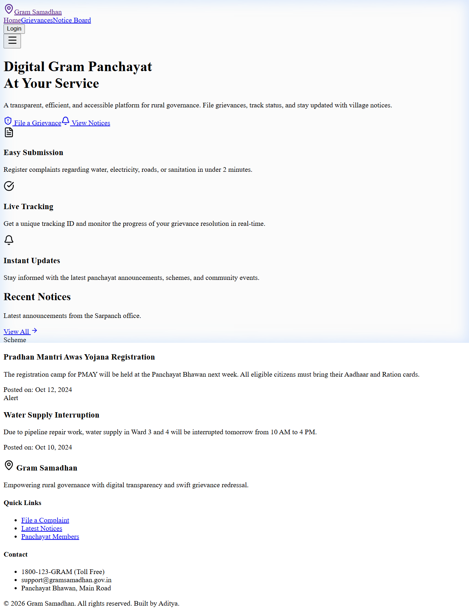
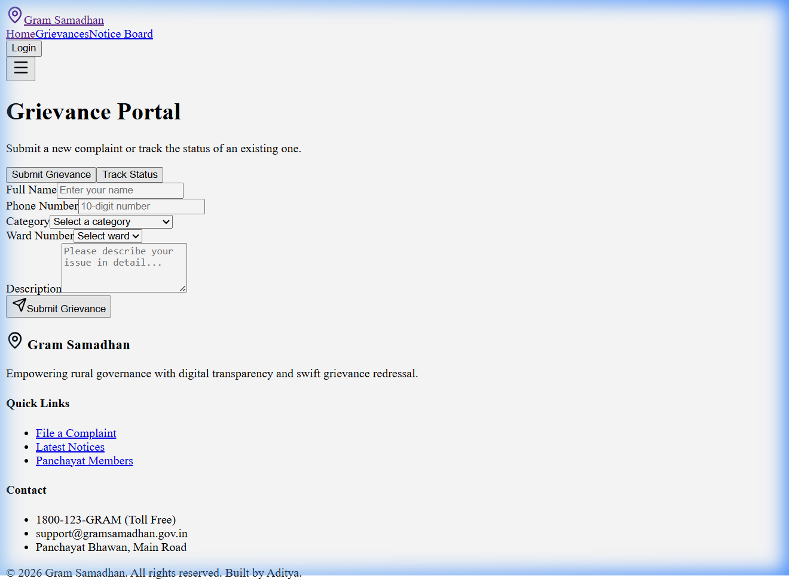
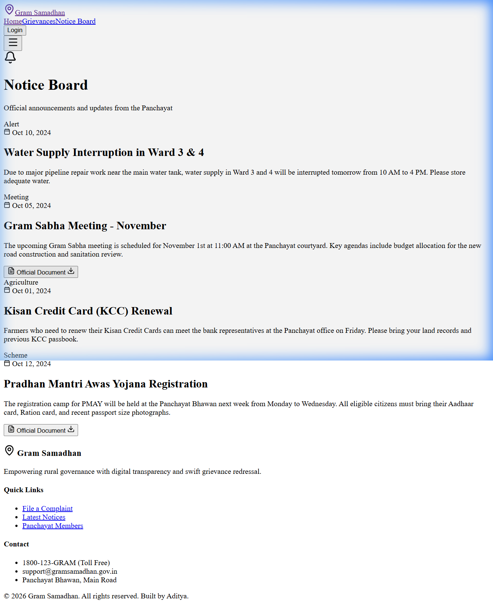

# 🏛️ Gram Samadhan — Digital Gram Panchayat Portal

<div align="center">

**A modern, full-stack platform for rural digital governance — built with React, Node.js, Express, and MongoDB.**

[](https://react.dev/)
[](https://nodejs.org/)
[](https://mongodb.com/)
[](https://tailwindcss.com/)
[](https://vitejs.dev/)

</div>

---

**Gram Samadhan** bridges the gap between rural citizens and their Gram Panchayat. Citizens can file and track grievances, stay updated on official notices, and access government scheme information — all from their phone or computer.

---

## 📸 Application Screenshots

### 🏠 Home Page
> Hero section, feature highlights, and a live preview of recent Panchayat notices.



---

### 📋 Grievance Portal
> File a complaint in under 2 minutes, or track an existing one using your Tracking ID.



---

### 📢 Notice Board
> Live notices pulled from MongoDB — including alerts, schemes, and meeting announcements.



---

## ✨ Key Features

| Feature | Description |
|---|---|
| 🛡️ **Grievance Submission** | Citizens submit complaints (Water, Electricity, Roads, Sanitation) with a unique tracking ID saved to MongoDB |
| 🔍 **Live Tracking** | Enter your Tracking ID (`GRV-XXXX-XX`) to pull real-time status from the database |
| 📢 **Notice Board** | Official Panchayat announcements fetched live from MongoDB |
| 📱 **Fully Responsive** | Designed for mobile-first usage in rural areas with limited screen sizes |
| ⚡ **Smooth Animations** | Framer Motion transitions throughout the application |

---

## 🛠️ Tech Stack

### Frontend
| Technology | Purpose |
|---|---|
| React 18 + Vite | Fast, modern component-based UI framework |
| Tailwind CSS | Utility-first styling with a custom green governance theme |
| Framer Motion | Smooth page transitions and micro-animations |
| React Router DOM v6 | Client-side routing |
| Lucide React | Icon library |

### Backend
| Technology | Purpose |
|---|---|
| Node.js + Express | RESTful API server running on port 5000 |
| MongoDB + Mongoose | Database with schema validation |
| CORS + dotenv | Security and environment configuration |

---

## 🚀 Getting Started (Local Setup)

> **Prerequisites:** [Node.js](https://nodejs.org/) and [MongoDB](https://www.mongodb.com/try/download/community) must be installed.

### Step 1: Clone the repository
```bash
git clone https://github.com/bhumiadi23/gram-samadhan.git
cd gram-samadhan
```

### Step 2: Start the Backend
```bash
cd backend
npm install
node server.js
```
✅ Server will start at `http://localhost:5000` and connect to MongoDB.

### Step 3: Seed the database (first time only)
```bash
# In a separate PowerShell window:
Invoke-RestMethod -Method Post -Uri http://localhost:5000/api/seed-notices
```

### Step 4: Start the Frontend
```bash
# Go back to the root directory
cd ..
npm install
npm run dev
```
✅ App will open at `http://localhost:5173`

---

## 📡 API Reference

| Method | Endpoint | Description |
|---|---|---|
| `POST` | `/api/grievances` | Submit a new grievance |
| `GET` | `/api/grievances/track/:trackingId` | Get grievance status by tracking ID |
| `GET` | `/api/notices` | Fetch all Panchayat notices |
| `POST` | `/api/seed-notices` | Seed initial notices (dev only) |

---

## 🗂️ Project Structure

```
gram-samadhan/
├── backend/
│   ├── models/
│   │   ├── Grievance.js      # Mongoose model for complaints
│   │   └── Notice.js         # Mongoose model for notices
│   ├── server.js             # Express API server
│   └── package.json
├── src/
│   ├── pages/
│   │   ├── Home.tsx          # Landing page with recent notices
│   │   ├── Grievance.tsx     # Submit & track complaints
│   │   └── Notices.tsx       # Notice board (live from DB)
│   ├── App.tsx               # Root layout, navigation, routing
│   └── index.css             # Tailwind base styles
└── vite.config.ts            # Vite config with API proxy
```

---

## 🤝 Contributing

Contributions, issues, and feature requests are welcome!  
Check the [issues page](https://github.com/bhumiadi23/gram-samadhan/issues) to get started.

## 📄 License

This project is open-source under the [MIT License](LICENSE).

---
<div align="center">
  Built with ❤️ for rural empowerment by <strong>Aditya</strong>
</div>
